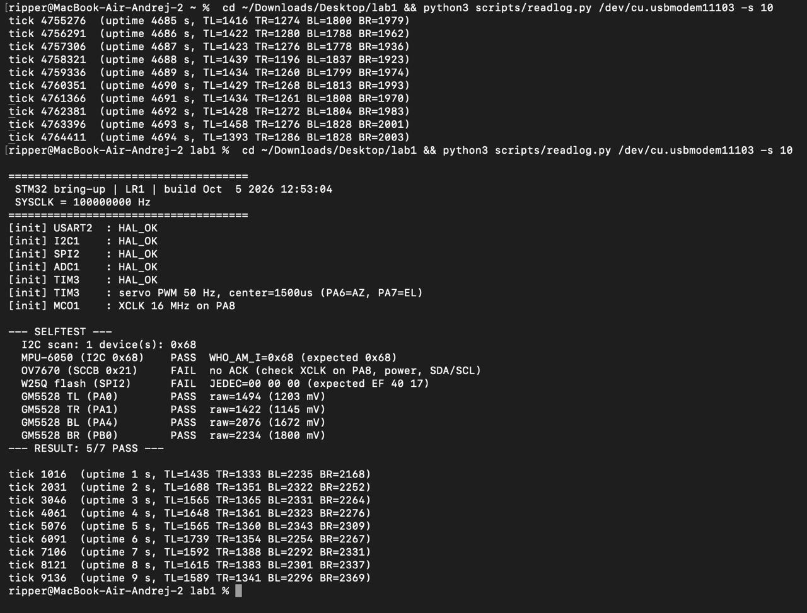

<!-- ТИТУЛЬНИЙ АРКУШ -->

Національний технічний університет України
«Київський політехнічний інститут імені Ігоря Сікорського»
Факультет інформатики та обчислювальної техніки

&nbsp;

&nbsp;

**Лабораторна робота № 1**

з дисципліни «Системне програмування вбудованих систем»

на тему «Налаштування середовища розробки та bring-up STM32-платформи (проєкт Heliostat)»

&nbsp;

&nbsp;

**Виконали:**
студенти групи ІО-36
Плешу Андрій
Варшавський Тимур

**Перевірив:**
Гордієнко Нікіта

&nbsp;

Київ — 2026

---

**Мета роботи:**

Я хотів підготувати проєкт так, щоб прошивку можна було зібрати в Docker і отримати робочий
UART-лог з реальної плати, перш ніж підключати датчики. Перший практичний результат для цієї
лабораторної: після прошивки NUCLEO-F411RE термінал має показати банер, тактування 100 МГц,
результат ініціалізації кожної периферії (`HAL_OK`) і блимання світлодіода. Під час роботи
зрозумів, що це не формальність: саме завдяки живому UART-логу й повторним прошивкам я
зрештою знайшов і виправив реальні помилки монтажу (переплутані VCC/GND і SCL/SDA на
MPU-6050), хоча спочатку здавалось, що датчик просто несправний.

Роботу виконували удвох: я відповідав за інфраструктуру, ядро прошивки й апаратне
налагодження, Тимур — за дослідження компонентів (даташити, точні параметри в
`hardware-components.md`).

**Постановка завдання:**

Спочатку орієнтувались на тему «Incident Recorder», але в процесі роботи 2026-10-04 змінили
її на **Heliostat** — геліостат, який квадрантом із 4 фоторезисторів GM5528 визначає напрямок
на джерело світла і наводить дзеркало двома серводвигунами (SG92R — азимут, SG90 —
елевація). Камера OV7670 додатково класифікує стан неба. Для ЛР1 (за підтвердженням
викладача) обов'язковим є лише bring-up: Docker-збірка, UART-логер, тактування, HAL-ініціалізація
GPIO/I2C/SPI/ADC/TIM3 з перевіркою `HAL_OK`. Ідентифікація датчиків — це вже ЛР2, але ми
підключили реальне залізо і довели результат до UART-логу понад мінімум.

Таблиця 1 — план компонентів Heliostat і їх стан на кінець ЛР1:

| Компонент | Інтерфейс | Стан на кінець ЛР1 |
|---|---|---|
| GM5528 ×4 (квадрант) | ADC | Читається стабільно на всіх 4 каналах; реальну світлочутливість (PASS від справжнього фоторезистора, а не від шуму на пустому вході) перевірено на залізі. |
| MPU-6050 | I²C | `WHO_AM_I=0x68` підтверджено неодноразово; контакт на макетній платі нестабільний (деталі нижче). |
| W25Q64JV-IQ | SPI | JEDEC `EF 40 17` підтверджено; той самий нестабільний контакт. |
| OV7670 | SCCB (I²C) | Підключено, але жодного разу не відповіла — залишено на ЛР2 за вказівкою викладача. |
| Серво SG92R/SG90 | PWM (TIM3) | Bring-up ініціалізації `HAL_OK`, фізичної реакції при подачі живлення не зафіксовано — перевірка мультиметром залишена на ЛР2. |

Репозиторій: https://github.com/Ripper-del/incident-recorder-lab1

---

**Хід роботи:**

**Підготовка проєкту та інфраструктури.**
Спочатку підняв Docker-тулчейн: `docker/Dockerfile` на основі `ubuntu:22.04` з
`gcc-arm-none-eabi`, `binutils-arm-none-eabi`, `libnewlib-arm-none-eabi` (libc для `printf`
у bare-metal) і `srecord`. Кореневий `Makefile` монтує репозиторій у контейнер і викликає
`make -C firmware all`; прапорець `--user $(id -u):$(id -g)` потрібен, щоб файли в
`firmware/build/*` належали мені, а не `root` (інакше їх не вийшло б видалити без `sudo`).
Додав CI (`.github/workflows/ci.yml`), яка збирає прошивку під F411 і F446 на кожен PR. Ці
файли і перший комміт — [8df3169](https://github.com/Ripper-del/incident-recorder-lab1/commit/8df3169), PR #1.

CubeMX у цій роботі не використовував — ініціалізацію HAL (тактування, GPIO, USART2, I2C1,
SPI2, ADC1, TIM3) написав вручну у `firmware/Core/Src/main.c` (функції `MX_*_Init`, за
стилем ті самі, що згенерував би CubeMX, але без `.ioc`-файлу). Оскільки для ЛР1 обов'язковий
лише UART-логер, це підтверджено як достатнє.

Ядро прошивки — комміт [73c92b4](https://github.com/Ripper-del/incident-recorder-lab1/commit/73c92b4) (PR #2): `SystemClock_Config()` піднімає SYSCLK з HSI 16 МГц через PLL
до 100 МГц (PLLN=400, PLLP=÷4), ініціалізує USART2 (115200 8N1), I2C1, SPI2, ADC1. Функція
`_write()` у `syscalls.c` перенаправляє `printf` у `HAL_UART_Transmit` на USART2 — завдяки
цьому банер і `tick` взагалі видно в терміналі.

**Перший вивід по UART.**

Рисунок 1 — реальний вивід після прошивки: банер `STM32 bring-up | LR1`,
`SYSCLK = 100000000 Hz`, усі рядки `[init] ... : HAL_OK` (USART2, I2C1, SPI2, ADC1, TIM3,
MCO1), блок `SELFTEST` з реальним станом кожного підключеного датчика, і далі `tick`
щосекунди зі значеннями квадранта TL/TR/BL/BR. У цьому конкретному запуску MPU-6050
показав `PASS WHO_AM_I=0x68`, а флеш — `FAIL` через нестабільний контакт (див. нижче).
Світлодіод LD2 блимає, кнопка B1 друкує `[btn ] B1 pressed` — перевірено окремо під час сесії.

**Проба датчиків.**
Проби (I²C-скан, MPU-6050, OV7670, W25Q64, квадрант) — комміт
[3a5fc89](https://github.com/Ripper-del/incident-recorder-lab1/commit/3a5fc89) (PR #3), пізніше розширено на 4 канали ADC і додано bring-up TIM3 для серво —
коміт [ff3223e](https://github.com/Ripper-del/incident-recorder-lab1/commit/ff3223e) (PR #4). У процесі з'ясував, що
встановлений флеш-чіп — Winbond W25Q64JV-IQ, а не W25Q32, як планувалось спочатку; виправив
очікуваний JEDEC з `EF 40 16` на `EF 40 17` і в коді, і в документації — коміт
[54b041b](https://github.com/Ripper-del/incident-recorder-lab1/commit/54b041b), PR #7.

Квадрант фоторезисторів GM5528 відповідав стабільно в кожному з десятків прогонів сесії.
З MPU-6050 і W25Q64 було складніше — нижче детально, що сталось.

**Складнощі під час роботи (мінімум 5, повний журнал з датами — `docs/problems.md`):**

1. **MPU-6050 перегрівався.** Одразу після підключення модуль GY-521 став гарячим на дотик —
   буквально за секунди. Причина: дроти VCC і GND були підключені навпаки (VCC йшов на GND
   плати, GND — на 3V3), і реверсивна напруга через вбудований стабілізатор модуля викликала
   нагрів. USB негайно відключив, перепідключив правильно (VCC→3V3, GND→GND) — нагрів зник.
   Апаратна правка, без зміни коду.

2. **MPU-6050 все одно не відповідав на I²C.** Навіть після виправлення живлення SELFTEST
   показував `no ACK`, I²C-скан — 0 пристроїв. Окремо від живлення виявилось переплутано SCL
   і SDA (D14↔D15 на платі). Поміняв дроти місцями — і SELFTEST почав стабільно показувати
   `WHO_AM_I=0x68 PASS`. Апаратна правка.

3. **Камера просідала живлення.** Коли підключив OV7670 повністю (18 пінів), `st-info`
   показав напругу плати ~2.62–2.65 В замість нормальних ~3.3 В, і одночасно відвалились і
   I²C, і SPI. Камера споживає помітно більше струму, ніж решта периферії, і просідає спільну
   рейку 3V3 на макетній платі. Тимчасово відключив камеру — напруга відновилась до ~3.2 В,
   решта датчиків запрацювала знову. Корінь підвищеного споживання самої камери не з'ясовано,
   залишаю на ЛР2.

4. **Невірний флеш-чіп у документації.** Планували W25Q32 (`EF 40 16`), а фактично на платі
   W25Q64JV-IQ (`EF 40 17`, маркування на корпусі `25Q64JVSIQ`). Виправив коментар у
   `w25q_probe.c`, очікуване значення в `selftest.c` і всі згадки в PRD/hardware-components/
   README — коміт [54b041b](https://github.com/Ripper-del/incident-recorder-lab1/commit/54b041b).

5. **Зависока швидкість шин для макетної плати.** MPU-6050 і W25Q64 почали нестабільно
   чергувати PASS/FAIL між прошивками без жодної зміни проводів — класична ознака шуму на
   довгих jumper-дротах при високій швидкості (I2C 100 кГц, SPI ~3.1 МГц). Знизив до 50 кГц і
   ~390 кГц відповідно — коміт [0715396](https://github.com/Ripper-del/incident-recorder-lab1/commit/0715396). SPI стало помітно стабільніше, I2C — лише частково.

6. **Залишкова нестабільність контактів — не вирішено.** Навіть після пп. 1, 2 і 5 обидва
   датчики й далі зрідка давали `FAIL` без будь-яких змін у проводах. Спробував нові
   jumper-дроти, другий окремий провід GND, перенесення MPU-6050 в інші гнізда макетки — жодне
   не дало стабільного результату остаточно. Обидва компоненти при цьому доказово справні
   (неодноразово відповідали коректно), тож справа в якості контактів конкретної макетної
   плати. На ЛР2 планую замінити дроти та/або саму плату.

7. **Камера OV7670 не відповіла жодного разу.** `no ACK` на SCCB у кожному прогоні сесії,
   незалежно від того, чи MPU-6050 був на тій самій шині. XCLK подавався незалежно від
   результату. За вказівкою викладача залишив перевірку камери на ЛР2.

8. **Серво не реагують на живлення.** Після bring-up TIM3 (`HAL_OK`, PWM 50 Гц, нейтральне
   положення 1500 мкс) серво SG92R/SG90 не показали жодної реакції — ні руху, ні звуку.
   Причина не з'ясована (ймовірно, живлення 5V), мультиметра під рукою не було — перевірка
   залишається на ЛР2.

**Висновки:**

Зрозумів на практиці, як HAL через `HAL_RCC_OscConfig`/`HAL_RCC_ClockConfig` піднімає SYSCLK
з HSI 16 МГц через PLL до 100 МГц, і що таймери на APB1 при дільнику ≠1 тактуються вдвічі
швидше за сам APB1 — це довелось порахувати вручну для TIM3, бо готового
`stm32f4xx_hal_tim.c` в цьому проєкті немає (підключені лише потрібні модулі HAL), і PWM я
налаштовував напряму через регістри CMSIS. Переконався, що «датчик не відповідає» на практиці
майже завжди означає помилку в проводах, а не несправність компонента — двічі підозрював
пошкодження чіпа, і обидва рази насправді проблема була в монтажі. І що макетна плата з
jumper-дротами має реальну межу надійності на високих швидкостях SPI/I2C.

Мета ЛР1 в межах обов'язкового мінімуму досягнута: прошивка збирається в Docker, CI зелена,
UART-лог стабільний (банер, `SYSCLK`, усі `HAL_OK`, `tick`, LED, кнопка). Понад мінімум —
підключив і довів до робочого стану квадрант фоторезисторів і (нестабільно) MPU-6050/флеш. У
ЛР2 планую: замінити jumper-дроти та/або макетну плату, розібратись із камерою і серво, і вже
тоді братися за логіку наведення й журналювання з `docs/PRD.md`. Якби робив зараз інакше —
перевіряв би кожен новий провід мультиметром одразу після підключення, а не вже після появи
симптомів.

**Матеріали:**

1. Репозиторій: https://github.com/Ripper-del/incident-recorder-lab1
2. PRD: [docs/PRD.md](https://github.com/Ripper-del/incident-recorder-lab1/blob/main/docs/PRD.md)
3. Журнал проблем: [docs/problems.md](https://github.com/Ripper-del/incident-recorder-lab1/blob/main/docs/problems.md)
4. Дослідження компонентів: [docs/hardware-components.md](https://github.com/Ripper-del/incident-recorder-lab1/blob/main/docs/hardware-components.md)
5. MPU-6000/6050 Product Specification Rev 3.4 — https://www.cdiweb.com/datasheets/invensense/mpu-6050_datasheet_v3%204.pdf
6. MPU-6000/6050 Register Map Rev 4.0 — https://cdn.sparkfun.com/datasheets/Sensors/Accelerometers/RM-MPU-6000A.pdf
7. W25Q64JV Datasheet Rev J (Winbond) — https://www.winbond.com/resource-files/w25q64jv%20revj%2003272018%20plus.pdf
8. OV7670/OV7171 Datasheet v1.01 (OmniVision) — https://www.voti.nl/docs/OV7670.pdf
9. ⟦STM32F411xC/E datasheet, RM0383, UM1724, UM1725 — посилання на st.com, сторінки дописати⟧
10. ⟦FT232RL datasheet — ftdichip.com, сторінки дописати⟧

**Відеозвіт:** ⟦посилання на Google Drive⟧
